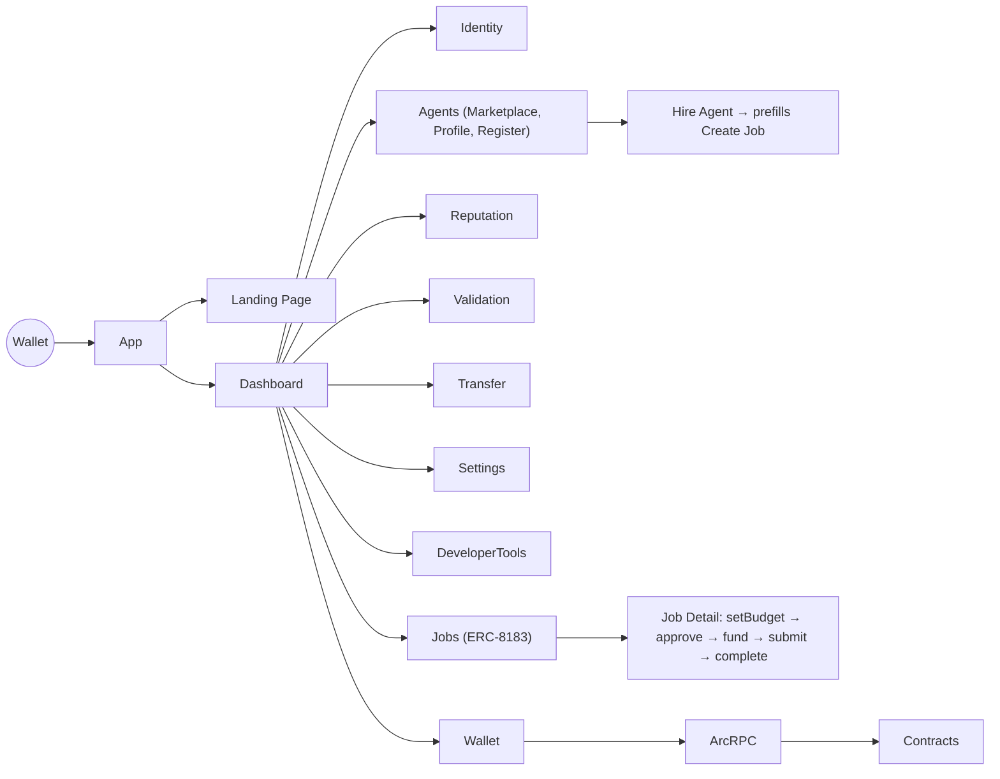

<div align="center">


# 🚀 Arc Agent Hub

### A Production-Ready Open-Source Dashboard for ERC-8004 AI Agents on Arc Testnet

**v5.1.0** — Build, manage, validate, and monitor AI Agent identities with a modern Web3 dashboard built using **React**, **Vite**, **ethers.js**, and **Arc Testnet**. Integrates **ERC-8183 Agentic Commerce** job lifecycle alongside ERC-8004 Identity, plus an Agent Marketplace for browsing, viewing profiles of, and hiring agents directly into a new job.

<p align="center">

[](https://github.com/Jaehaerysp/arc-agent-hub-v3/actions/workflows/build.yml)

[](https://github.com/Jaehaerysp/arc-agent-hub-v3/actions/workflows/lint.yml)

[](LICENSE)

[](https://docs.arc.network)

[](https://react.dev)

[](https://vitejs.dev)

[](https://docs.ethers.org)

[](https://YOUR-VERCEL-URL.vercel.app)

</p>

### 🌐 Links

**🚀 Live Demo** • **📖 Documentation** • **💻 GitHub** • **🐛 Report Bug** • **💡 Request Feature**

- **Live Demo:** https://arc-agent-hub-v3.vercel.app
- **GitHub:** https://github.com/Jaehaerysp/arc-agent-hub-v3
- **Architecture:** ./ARCHITECTURE.md
- **Changelog:** ./CHANGELOG.md
- **Full documentation:** ./docs/OVERVIEW.md

---

</div>

# ✨ Why Arc Agent Hub?

Arc Agent Hub is a **production-ready reference implementation** demonstrating how developers can build modern Web3 applications on **Arc Testnet** using the **ERC-8004 AI Identity Protocol**.

Instead of being just another demo project, Arc Agent Hub provides a complete developer experience featuring:

- Modern React architecture
- Feature-based folder structure
- Glassmorphism UI
- Centralized smart contract registry
- Responsive dashboard
- Developer tools
- Documentation
- GitHub Actions
- Open-source best practices

Whether you're building AI Agents, experimenting with ERC-8004, or learning Arc development, this project serves as a complete starting point.

---

# 🎯 Features

| Feature | Description |
|----------|-------------|
| 🤖 AI Agent Identity | Register ERC-8004 AI Agents on-chain |
| 🛒 Agent Marketplace | Browse, search, and filter a catalog of AI agents by category |
| 👤 Agent Profile | Per-agent profile page (`/agents/:wallet`) with reputation, stats, and activity |
| 🤝 Hire Agent | One click from a Marketplace card or profile pre-fills a new ERC-8183 job with that agent as the provider |
| ⭐ Reputation | Submit and manage reputation feedback |
| 🛡 Validation | Request validator reviews and monitor status |
| 💸 ANV Wallet | Send ANV tokens with live balances |
| 📊 Dashboard | Wallet overview, analytics and activity |
| 🛠 Developer Tools | Chain information, contracts, RPC and explorer |
| ⚙ Settings | Theme, network info and application settings |
| 🎨 Design System | Reusable components with glassmorphism styling |
| 📱 Responsive | Desktop, Tablet and Mobile support |
| 💼 Jobs (ERC-8183) | Agentic Commerce job lifecycle — dashboard, create, history, and per-job detail with the full create → budget → approve → fund → submit → complete flow |

> **Note:** the Marketplace is currently backed by a curated, static agent catalog (`src/data/agents.js`), not live on-chain discovery — see [Known Limitations](#-known-limitations) below.

---

# 🏗 Architecture



For complete architecture details, see:

**📖 ARCHITECTURE.md**

---

# 📸 Screenshots

| Landing Page | Dashboard | Developer Tools |
|---------------|-----------|-----------------|
|  |  |  |

---

# 🎬 Demo

> Replace with an actual screen recording.


---

# ⚙ Technology Stack

- React 18
- Vite
- React Router
- ethers.js v6
- Arc Testnet
- ERC-8004
- ERC-8183
- JavaScript
- CSS
- Vitest + React Testing Library
- GitHub Actions
- Vercel

---

# 🚀 Installation

Requirements

- Node.js 18+
- npm
- MetaMask or Rabby Wallet

Clone

```bash
git clone https://github.com/Jaehaerysp/arc-agent-hub-v3.git
cd arc-agent-hub-v3
```

Install

```bash
npm install
```

Run

```bash
npm run dev
```

Production Build

```bash
npm run build
```

Preview

```bash
npm run preview
```

Lint

```bash
npm run lint
```

Test

```bash
npm test
```

---

# ⚙ Configuration

| Item | Location |
|------|----------|
| Chain Configuration | src/chains/arc.js |
| Contract Registry (ERC-8004) | src/contracts/registry.js |
| Contract Registry (ERC-8183) | src/lib/blockchain/ |
| Agent Catalog (Marketplace) | src/data/agents.js |
| Design Tokens | src/styles/tokens.css |
| Navigation | src/app/nav.js |

No environment variables are required.

---

# 📜 Smart Contracts

| Contract | Address |
|----------|---------|
| Identity Registry | `0x8004A818BFB912233c491871b3d84c89A494BD9e` |
| Reputation Registry | `0x8004B663056A597Dffe9eCcC1965A193B7388713` |
| Validation Registry | `0x8004Cb1BF31DAf7788923b405b754f57acEB4272` |
| ANV Token | `0x736223037D622ed365fa641a116daAcED7A5be96` |

**ERC-8183 (Agentic Commerce)** — full job lifecycle UI live as of Sprint 2, with a professional stats/search/filter/activity dashboard layer added in Sprint 3:

| Contract | Address |
|----------|---------|
| Agentic Commerce | `0x0747EEf0706327138c69792bF28Cd525089e4583` |
| USDC | `0x3600000000000000000000000000000000000000` |

---

# ⚠ Known Limitations

The deployed ERC-8004 Identity Registry ABI only exposes `register(string)` and a `Transfer` event — there is no `totalSupply()`, `tokenURI()`, `ownerOf()`, or `tokenByIndex()`. Without one of those, the app has no on-chain way to enumerate every registered identity.

Because of this, the Agent Marketplace (`src/data/agents.js`) is **intentionally** a curated, static catalog rather than a live query against the registry. Everything else about the Marketplace — search, filtering, stats, profile pages, and the hire-into-a-job flow — is fully functional; only the underlying agent list isn't yet sourced from the chain. See `docs/MARKETPLACE.md` and `docs/PROJECT_ROADMAP.md` for the planned path to real on-chain (or indexer-backed) discovery.

---

# 🌐 Arc Testnet

| Property | Value |
|----------|-------|
| Network | Arc Testnet |
| Chain ID | 5042002 |
| RPC | https://rpc.testnet.arc.network |
| Explorer | https://testnet.arcscan.app |
| Native Currency | USDC |

---

# 🚀 Deployment

Deploy easily using:

- Vercel
- Netlify
- Cloudflare Pages
- GitHub Pages

Build

```bash
npm run build
```

Output folder

```
dist
```

---

# 🛣 Roadmap

- ✅ ERC-8004 Identity
- ✅ Reputation
- ✅ Validation
- ✅ ANV Transfers
- ✅ Developer Tools
- ✅ Responsive Dashboard
- ✅ Landing Page
- ✅ ERC-8183 Agentic Commerce — services, routes & navigation (Sprint 1)
- ✅ ERC-8183 Agentic Commerce — job lifecycle UI (Sprint 2)
- ✅ Job Management dashboard — stats, search, filters, sorting & activity feed (Sprint 3)
- ✅ Agent Marketplace, Agent Profile pages & Hire Agent flow (v5.0)
- ✅ Documentation overhaul, `usePolling` extraction & Vitest test suite (v5.1 — this release)
- 🔄 On-chain (or indexer-backed) Agent Discovery, replacing the static catalog
- 🔄 Analytics Dashboard
- 🔄 Multi-chain Support
- 🔄 WalletConnect Support

See `docs/PROJECT_ROADMAP.md` for the detailed sprint-by-sprint plan.

---

# 🤝 Contributing

Contributions are welcome!

Please read:

- CONTRIBUTING.md
- CODE_OF_CONDUCT.md
- SECURITY.md

before submitting a Pull Request.

---

# 📄 License

Licensed under the **MIT License**.

See the LICENSE file for details.

---

# 🙏 Acknowledgements

Built with ❤️ for the Arc Developer Community.

Special thanks to:

- Arc Network
- ERC-8004 Contributors
- Open Source Community

---

<div align="center">

### ⭐ If you find this project useful, please consider giving it a Star on GitHub!

**Built with React • Vite • ethers.js • Arc Testnet**

</div>